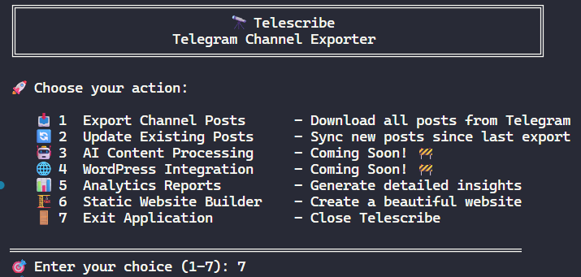

# 🔭 Telescribe

**Telescribe** is a .NET console application for managing content from your Telegram channel. Export your posts, enrich them with AI, publish a static website, or push everything to WordPress.

It is built for creators who want real control over their content rather than leaving it locked inside Telegram.

## Summary

Telescribe turns your Telegram channel into a content hub. It exports posts with media and engagement metadata, optionally enhances them with AI (titles, hashtags, summaries), and supports several publishing workflows. You can generate a static website, sync posts to WordPress, or just keep a local searchable archive.

## Features

### 📥 **Telegram Export**
- Export all posts from any Telegram channel you have access to
- Download media files (images, videos, documents, audio)
- Incremental updates: sync only new posts since the last export
- Captures views, reactions, and forward counts per post
- Exports to Markdown files for easy processing

### 🤖 **AI Content Processing**
- **Multi-Provider Support**: OpenAI, DeepSeek, Ollama
- **Smart Title Generation**: Automatically create readable titles for posts
- **Hashtag Extraction**: Pull relevant hashtags from content
- **Content Enhancement**: Improve readability and SEO
- **Batch Processing**: Handle large volumes of posts efficiently

### 🏗️ **Static Website Generation**
- Generate a responsive static website from your exported posts
- **Multi-Language Templates**: English (`en`) and Persian/Farsi (`fa`) built in, plus custom templates
- **Search, Sort, and Pagination**: All client-side with no external dependencies
- **Browser History Support**: Back and forward navigation works naturally
- **SEO Ready**: Sitemap.xml, meta tags, and clean structure
- **About Page**: Rendered from template if your template includes one

### 📊 **Analytics and Reporting**
- Comprehensive analytics reports with engagement metrics
- **Template-Based Reports**: HTML reports via the template system
- **Key Metrics**: Views, reactions, forwards, and engagement analysis
- **Visual Charts**: Dashboard-style analytics interface

### 🌐 **WordPress Integration**
- Direct publishing to WordPress sites
- **Media Upload**: Automatic media file uploads to WordPress
- **Category Management**: Automatic category creation and assignment
- **Post Mapping**: Track published posts to avoid duplicates

### ⚙️ **Advanced Features**
- **Template System**: Flexible `{{placeholder}}` engine, easy to extend
- **Media Handling**: Copies all Telegram media into the generated site
- **Empty Post Filtering**: Skip polls and media-only posts via config

## Requirements

### System Requirements
- **.NET 10.0** runtime or higher

### Telegram API Setup
- **Telegram API credentials** from [https://my.telegram.org/](https://my.telegram.org/)
  - API ID
  - API Hash
  - Phone number (international format)
- **Channel access** (you must be a member of the target channel)

### Optional Dependencies
- **AI Services** (choose one):
  - OpenAI API key for GPT models
  - DeepSeek API key for cost-effective processing
  - Ollama local installation for offline processing
- **WordPress site** with application password for publishing

## Screenshots

### Main Menu


### Static Site Index Page


### Static Site Post Page


### Channel Analytics Report


---

## How to Run

### 🔨 Coming soon: Available as a .NET tool!

### 1. Clone and Build
```bash
git clone https://github.com/aminmesbahi/telescribe.git
cd telescribe/src
dotnet build
```

### 2. Configuration Setup
Copy `appsettings.example.json` to `appsettings.json` in `Telescribe.Console` and fill in your values:

```json
{
  "TelegramConfig": {
    "PhoneNumber": "+1234567890",
    "ChannelId": "@yourchannel",
    "ApiId": 12345678,
    "ApiHash": "your-api-hash",
    "SummaryCharacterCount": 200,
    "LLM": {
      "EnableProcessing": true,
      "Provider": "OpenAI",
      "ApiKey": "your-api-key",
      "ModelName": "gpt-4",
      "GenerateTitle": true,
      "ExtractHashtags": true,
      "MaxHashtags": 5,
      "Language": "English"
    },
    "WordPress": {
      "BaseUrl": "https://yoursite.com",
      "Username": "your-username",
      "Password": "your-app-password",
      "EnableUploads": true,
      "DefaultCategoryId": "Telegram Posts"
    },
    "StaticSite": {
      "SiteTitle": "My Telegram Archive",
      "Subtitle": "Content from my Telegram channel",
      "TemplateName": "en",
      "MaxPostsInIndex": 50,
      "OpenBrowserAfterGeneration": true,
      "SkipEmptyContentPosts": false,
      "SiteBaseUrl": "https://yoursite.com"
    }
  }
}
```

### 3. Run the Application

Interactive mode:
```bash
cd Telescribe.Console
dotnet run
```

Command line shortcuts:
```bash
# Generate static website directly
dotnet run --project Telescribe.Console static

# Generate analytics reports directly
dotnet run --project Telescribe.Console reports
```

### 4. Menu Options
1. **Export Channel Posts** - Download all posts from Telegram
2. **Update Existing Posts** - Sync new posts since the last export
3. **AI Content Processing** - Coming soon
4. **WordPress Integration** - Coming soon
5. **Analytics Reports** - Generate engagement insights
6. **Static Website Builder** - Create a browsable static website
7. **Exit Application**

## Templates

Templates live in `src/Telescribe.Console/templates/{name}/` and consist of plain HTML files with `{{placeholder}}` variables. The built-in templates are `en` (English) and `fa` (Persian/RTL). To create a custom template, copy an existing folder and adjust the HTML and CSS files.

## Roadmap

### Version 1.0 (In Development)
- [ ] Complete AI content processing
- [ ] Complete WordPress integration
- [ ] Stable release with bug fixes

### Version 2.0 (Planned)
- [ ] Real-time sync and auto-update
- [ ] Database support for large archives
- [ ] REST API for programmatic access
- [ ] Web dashboard

### Version 3.0 (Ideas)
- [ ] Multi-channel support
- [ ] Content scheduling
- [ ] Plugin system for custom extensions
- [ ] Docker and cloud deployment

## Known Issues

- **LLM Processing**: Partially implemented, still in development
- **WordPress Upload**: Menu option visible but full integration is in progress
- **API Rate Limits**: Telegram API has built-in rate limiting; large channels may take a while

## License

MIT License. See [LICENSE](LICENSE) for details.

## Contributing

Contributions, issues, and feature requests are welcome. Feel free to open a pull request or file an issue on GitHub.

## Support

- **GitHub Issues**: [Create an issue](https://github.com/aminmesbahi/telescribe/issues)
